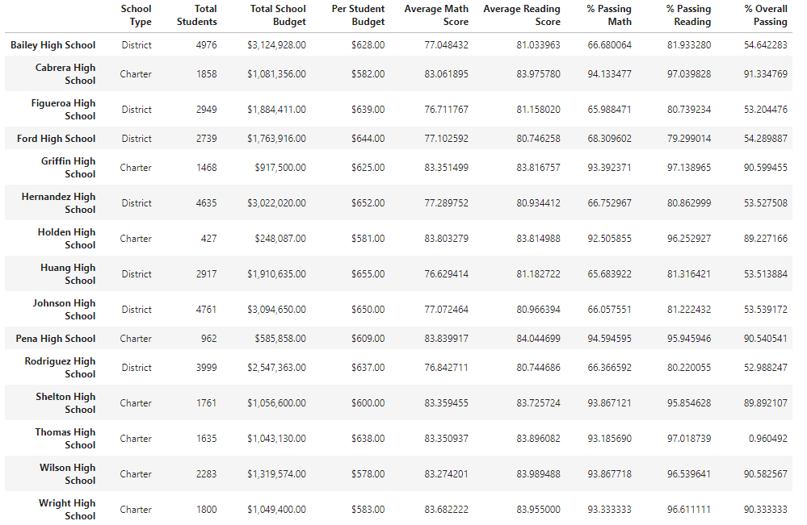
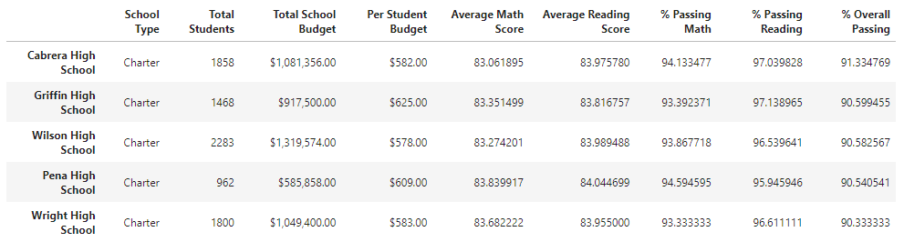
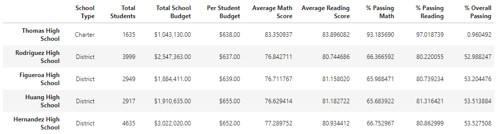
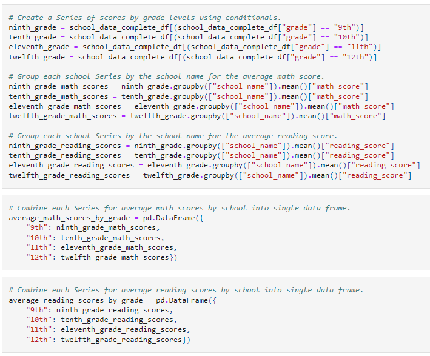
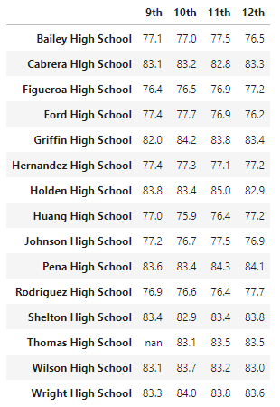
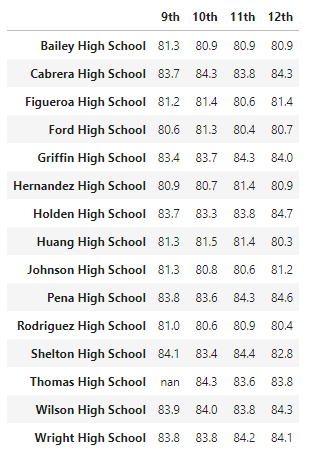
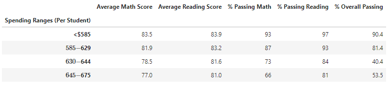
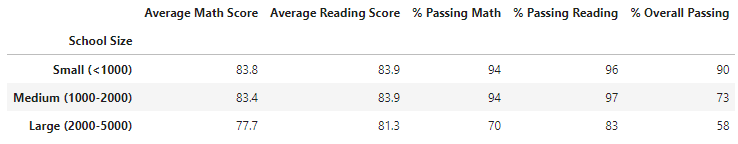
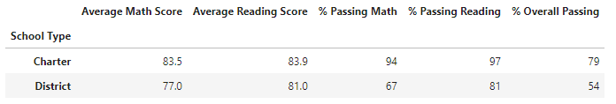

# School District Analysis

## Resources
  * Data sources: 
    * [students_complete.csv](Resources/students_complete.csv)
    * [schools_complete.csv](Resources/schools_complete.csv)
  * Software: 
    * Anaconda 4.11.0
    * Jupyter Notebook 6.4.5 
    * Python 3.9.7
    * Visual Studio Code 1.63.2

## Overview/Purpose
The purpose of this analysis was to replace the Thomas High School (THS) 9th grader's math and reading grades due to the data being potentially inaccurate/falsified. After cleaning the data I then needed to recreate summaries for individual school and the entire district based on student grade data and budgets. Specifically I was asked to provide...
*   The district summary
*   The individual school summaries
*   The top and bottom five schools based on overall passing rates
*   The average math and reading scores for each grade
*   The average math and reading scores by school spending per student
*   The average math and reading scores by school size
*   The average math and reading scores by school type

## Results
### Cleaning the data
Removing the THS 9th grader's math and reading scores was completed by using the `.loc` method. 
The code below gathered all the 9th grade students from THS and replaces their reading and math scores with "NaN".

```
student_data_df.loc[(student_data_df["school_name"] == "Thomas High School")
& (student_data_df["grade"] == "9th"), "reading_score"] = np.nan

student_data_df.loc[(student_data_df["school_name"] == "Thomas High School")
& (student_data_df["grade"] == "9th"), "math_score"] = np.nan
```

When we display the student data DataFrame, we can see that the THS 9th grade scores have been replaced with NaN

#### Snapshot of the updated student data
.png)

### Updated School Summaries
After removing those scores, we were able to update our district summary.

Shown here is the updated per school summary DataFrame with the new average and percent passing reading and math scores, accounting for the removal of the THS 9th grade

#### Individual School Summary


### High/Low Performing Schools
Using the `per_school_summary_df` and sorting by the overall percent passing, I was able to show the top and bottom performing schools in the district.

The code to sort these schools looked like this 

```
top_schools = per_school_summary_df.sort_values(["% Overall Passing"]ascending  = False)
top_schools.head(5) 
bottom_schools = per_school_summary_df.sort_values(["% Overall Passing"], ascending = True)
bottom_schools.head(5)
```

And the results of this sorting are shown in the images below

#### Top 5 Schools

#### Bottom 5 Schools


### Math and Reading Scores by Grade
To gather the information for math and reading scores by grade conditionals and the `.groupby` method was used. After which all data was placed into data frames. Below is a image of what the code looked like

#### Scores by Grade Code Snapshot


After a little formatting to make the data easier to read, these were the resulting data frames
* Note that the THS 9th grade scores are still NaN

#### Average Math Scores by Grade

#### Average Reading Scores by Grade


### Scores by School Spending, Size, and Type
#### Spending
Using the same `.groupby` method, the same process for bringing together average score by grade could be used to find the scores by spending per student. I placed the schools into bins and based on the minimum and maximum amounts of spending per student using this code.

```
# Establish the spending bins and group names.
spending_bins = [0, 585, 630, 645, 675]
group_names = ["<$585", "$585-$629", "$630-$644", "$645-$675"]
per_school_capita.groupby(pd.cut(per_school_capita, spending_bins)).count()
# Categorize spending based on the bins.
per_school_summary_df["Spending Ranges (Per Student)"] = pd.cut``>(per_school_capita, spending_bins, labels = group_names) 
```
The group names and ranges that were used were because this distribution more evenly split the schools. After making another data frame and for the spending summary and formatting it, and here are the results

##### Scores by Spending


#### Size

Similar to Scores by School Spending, I binned the schools into three different ranges and compared them to the scores The ranges were: Small (<1000>), Medium (1000-2000), and Large (2000-5000). Then I made new data frame for the averages based on the ranges, formatted it, and here are the results

##### Scores by Size


#### Type

And lastly, I made the last data frame based on the averages for the type of school: Charter v District. Calcualted the averages once again, formatted, and here are the results.

##### Scores by Type


## Summary
There were four major changes that occurred due to the omission of the THS 9th grade score data. 
*   The analysis has become less accurate. Because of the missing data points, our overall analysis suffered. Since the data was removed due to possible manipulation, both analysis with and without the data does not show the truest version of how the school district is performing.
*   After removing the data, the overall passing percentage of THS **significantly decreased**. 
*   THS went from being one of the best performing schools in the district (top 5) to one of the worst performing schools (bottom 5)
*   There is now a significant difference in overall passing percentage between charter and district schools.

These finding show how wide spread and devastating the loss of the data was for both THS and for the district overall.
